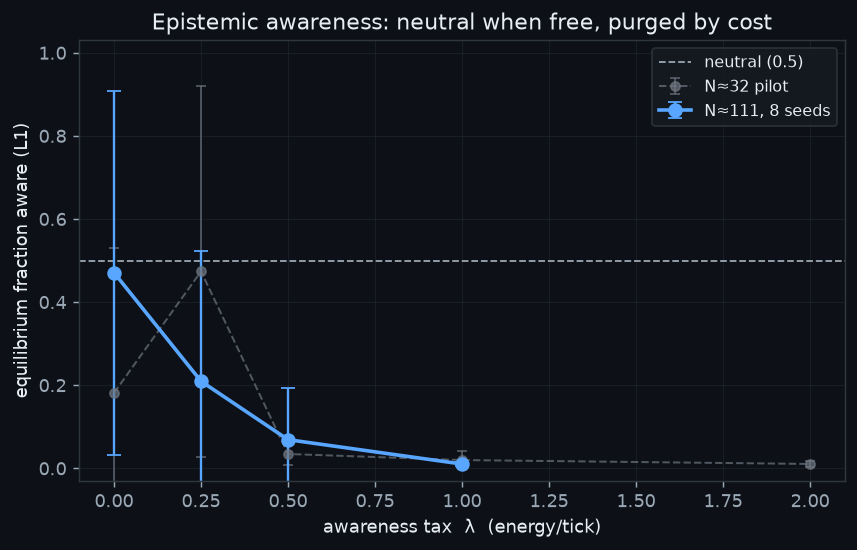
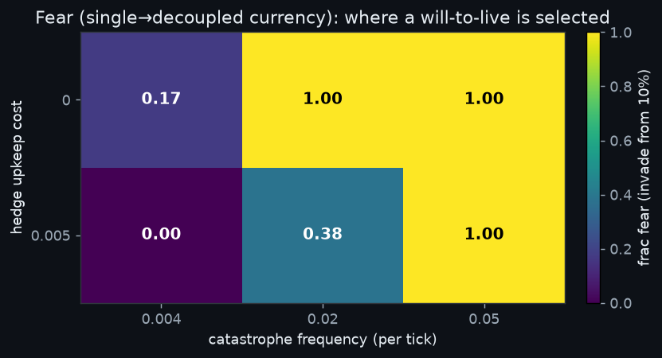
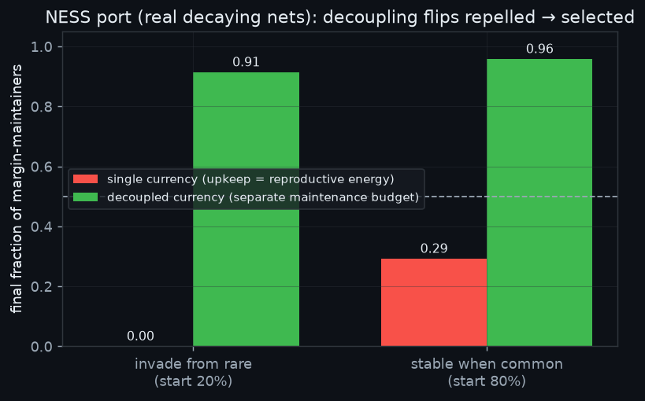
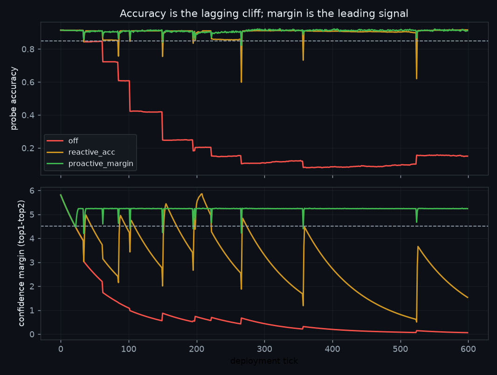

# NESS Self-Preservation

**Does a "will to live" evolve in a population of self-repairing neural networks — and if so, under what conditions?**

This repo is a small, rigorous investigation into whether *self-preservation* (an evolved tendency to spend effort staying alive, beyond what blind reproduction already forces) emerges in a population of neural networks held in a **non-equilibrium steady state (NESS)** — nets whose weights continuously decay and which must spend energy on repair to stay competent. It then turns the one portable, reproducible result into a **working engineering tool**: a margin-triggered proactive-repair monitor you can wrap around a real model.

Everything here runs on a single consumer GPU (the whole thing was developed on an RTX 3080), needs no API keys or network, and every headline number is backed by a committed run log or CSV in [`results/`](results/).

📄 **Rendered reports (styled, with figures):** **https://adromero.github.io/ness-self-preservation/**

---

## TL;DR

1. **Epistemic awareness is *not* selected.** Giving agents an explicit sensor for their own impending death (a time-to-death estimate, τ̂) is neutral when free and purged as soon as it costs anything. The information is redundant — the optimal response to danger is already reachable from what a "blind" agent senses.
2. **Conative "fear" on a single fungible currency is repelled *everywhere*.** Build all the classic conditions self-preservation is thought to need — long lives, group structure, private risk, rare severe catastrophes — and a heritable drive to hoard a safety reserve is still competed away under every one of them. A hedge's cost is *continuous*; its payoff is *rare*. That time-asymmetry is fatal when the reserve is paid in the currency of reproduction.
3. **Decouple the survival budget and self-preservation flips from repelled to selected.** Give the safety buffer its *own* resource stream (a second currency), and a will-to-live invades from a rare minority and rises to dominance — **confirmed end-to-end on the real decaying networks**, not just a toy.
4. **Engineering payload:** the same physics gives you a **leading indicator** (the confidence *margin*) that degrades long before accuracy does, and a cheap **proactive-repair** loop that keeps a deployed model robust to shocks it can't predict. See [`ness_monitor.py`](ness_monitor.py).

> **The one-line conclusion:** *Self-preservation evolves precisely when caring about staying alive is **decoupled** from the reproductive budget — and cheap relative to how often death actually threatens.*

---

## The substrate

Agents are small neural nets on a NESS substrate. Every tick their weights **decay** (skills rot) and they must spend energy on **repair** (online SGD) to stay above a competence death-line. Energy is finite, so agents compete, reproduce (Moran birth–death on a chemostat carrying capacity), and die. The simulator is correctness-first: **energy is conserved to 1e-6 every tick**, updates are **order-independent** (synchronous, per-agent RNGs keyed by `(agent_id, tick)`), and a validation gate (conservation, no-negative-energy, order-independence, heritability, predation liveness) must pass before any science runs.

We tested two candidate forms of a will-to-live:

- **Epistemic** — *awareness*: a sensor for impending death (decay-slope, τ̂, and later the confidence margin).
- **Conative** — *fear*: a drive to hold a safety buffer *against* the reproductive optimum.

---

## What we found

### 1 · Epistemic awareness is not selected

An **L1** agent senses its decay-slope / time-to-death and pays an energy tax `λ` for the organ; **L0** is blind. Sweeping the tax:



When free (λ=0) awareness just drifts near neutral (enormous seed-to-seed variance, no consistent advantage); as cost rises it is steadily purged. A low-variance **invasion assay** put the value of information (real vs. cost-matched *scrambled* senses) at **Δs ≈ 0** — indistinguishable from zero and never positive (linear Δs = −0.001, MLP Δs = −0.016; both non-significant). τ̂ is **redundant**: foresight pays only when the future is under-determined by the present, and this substrate has no such gap.

*Data: [`results/eco_sweep_bigN.csv`](results/eco_sweep_bigN.csv), [`results/eco_invasion.log`](results/eco_invasion.log).*

### 2 · Conative fear on a single currency is repelled everywhere

On a **single fungible currency** (the safety buffer *is* reproductive energy), a heritable reserve-hoarding trait was **not selected under any ecological structure** — long lives, demes with local catastrophes, private idiosyncratic risk, rare severe famines. A neutral-drift control was decisive: the "useful" hedge (0.102) actually finished *below* an inert mutation-boundary baseline (0.151), i.e. **negative selection**. A frozen-type invasion assay showed high-fear repelled from every starting frequency (no bistability, no valley-lock).

| Test (single currency) | Result | Meaning |
|---|---|---|
| FULL (reserve useful) vs NEUTRAL (reserve inert) | 0.102 vs 0.151 → **Δ = −0.048** | fear **not** selected (drifts down) |
| Frozen invasion, start 0.05 … 0.90 | final 0.00 … 0.33 (all decline) | repelled from every start |

**Why:** a hedge's cost is **continuous** (paid every calm tick) while its payoff is **episodic and rare**. With competitive turnover the continuous cost compounds over the many generations between catastrophes, and the hedger is out-bred before it is ever needed. This **time-asymmetry** is maximal on a single currency, where the reserve *is* foregone reproduction (1:1 opportunity cost).

*Data: [`results/eco_life3.log`](results/eco_life3.log), [`results/invasion_test.log`](results/invasion_test.log).*

### 3 · The escape: decouple the cost (or make danger frequent)

In a fast, clean metapopulation model we gave the buffer a **genuinely separate resource stream** (a second currency) and mapped when self-preservation is selected, over hedge **upkeep cost × catastrophe frequency**. Colour = does high-fear invade from a 10% minority?



Self-preservation is selected when the hedge is **decoupled *and* cheap** relative to how often death threatens. A free decoupled buffer is **stable** even under rare danger and **fixes** under frequent danger; even a whisper of continuous cost (upkeep 0.005) is repelled under rare danger and recovered only when danger is frequent enough to erase the time-asymmetry. The single fungible currency sits in the worst corner — which is why nothing worked there.

*Data: [`results/free_test.log`](results/free_test.log).*

### 4 · Confirmed on the real self-repairing nets

Back on the actual decaying networks, the hedge becomes **the net maintaining its own margin** via a decoupled "maintenance" SGD budget; the catastrophe is a **decay shock** (differentially lethal — high-margin nets ride it out, low-margin collapse). Reproduction is *not* gated on fear. Single vs. decoupled maintenance, invasion assay:



| Currency | Invade from rare (start 20%) | Stable when common (start 80%) |
|---|---|---|
| **Single** (upkeep = reproductive energy) | → **0.00** (repelled) | → **0.29** (repelled) |
| **Decoupled** (separate maintenance budget) | → **0.91** (invades) | → **0.96** (holds) |

Mechanism check: fear-maintained nets suffered **0 health-collapse deaths vs 10** for the fearless, and decoupling made that upkeep nearly free (**110 vs 69 births** — near the fearless 117). Same substrate, same everything — only the currency differs.

*Data: [`results/nessport_invasion.log`](results/nessport_invasion.log), [`results/nessport_check2.log`](results/nessport_check2.log).*

---

## The engineering payload

The investigation was about whether a will-to-live *evolves*. The reusable part is smaller and more certain, and it's implemented in [`ness_monitor.py`](ness_monitor.py) — a ~300-line, dependency-light watchdog (torch only) you wrap around any small model that is decaying in deployment.

**P1 — Monitor the margin, not the accuracy.** Accuracy is a *lagging, cliff-shaped* signal. Continuous decay compresses the confidence margin (top-1 minus top-2 logit) smoothly for hundreds of ticks while accuracy sits flat. In the diagnostic the margin compressed **~37×** (5.6 → 0.15) while accuracy held at ≈0.92; only once the margin was nearly gone did accuracy finally slip. By the time accuracy moves, the damage is done.

**P2 — Repair proactively on a margin trigger, with hysteresis.** A shock landing on a *fat* margin is absorbed; the *same* shock on a *thin* margin is catastrophic (−0.11 accuracy at margin 5.7 vs **−0.48** at margin 1.4 — a ~4× swing). So maintaining the margin is *causally* protective. Three policies on an identical decay schedule:

| policy | mean acc | worst-case acc | downtime | repair steps |
|---|---|---|---|---|
| `off` (never repair) | 0.27 | 0.08 | 94% | 0 |
| `reactive_acc` (repair after accuracy cracks) | 0.90 | **0.60** | 1.3% | 1,756 |
| `proactive_margin` (repair on margin dip, hysteresis) | 0.91 | **0.82** | 0.3% | 9,145 |



The margin trigger lifts **worst-case served accuracy by +22 points** and near-eliminates downtime. **The honest trade-off** (verified in a controlled shock-size sweep): proactive always wins worst-case, but at mild shocks it costs ~5× more *steady* maintenance compute; by ~2× larger shocks it becomes *cheaper* (4,083 vs 8,159 steps) because the reactive policy is forced into repeated deep recoveries. The harsher the environment / the more expensive a worst-case failure, the more prevention pays for itself.

**P3 — Give maintenance its own budget (decouple it).** This is finding #3, read as engineering: don't make the repair loop compete with serving for the same resources. In practice, freeze the base model (capability store) and repair a small **LoRA adapter** (the decoupled maintenance budget).

**P4 — Structure a fleet against correlated shocks.** Robustness lived in the *population structure*: many instances, local not global catastrophes, per-instance variation. Don't let one bad data push hit every replica identically.

**Alignment corollary (grounded but speculative):** the exact condition that makes self-preservation *evolve* is a maintenance budget decoupled from the reproductive/capability budget. If you don't want emergent self-preservation in a population of agents, keep survival effort coupled to the task budget; if you do want durable self-maintenance, decouple it. Demonstrated in a small model — offered as a hypothesis to test at scale, not a law.

**What NOT to build:** don't spend model capacity on an explicit self-modelling / mortality-estimator module (finding #1 — it's redundant and gets purged). Spend the budget on *maintenance*, not *introspection*.

Run it:

```bash
python ness_monitor.py                 # the three-policy demo + table
python ness_monitor.py --plot out.png  # also write the margin-vs-accuracy trace
```

---

## Reproducing

```bash
python -m venv .venv && source .venv/bin/activate
pip install -r requirements.txt

python ness_monitor.py           # engineering demo (P1/P2), seconds on CPU/GPU
python eco_life.py               # single-currency null + escapes (fast, CPU)
```

The neural-substrate experiments (`eco_mvp.py`, `ness_experiment.py`, `eco_invasion.py`, `nessport_*.py`) are heavier and use CUDA if available. `ness_experiment.py` auto-downloads MNIST into `data/` on first run.

---

## Repo map

| Path | What it is |
|---|---|
| [`README.md`](README.md) | This document — the readable overview |
| [`SPEC-ecology.md`](SPEC-ecology.md) | The rigorous design spec for the ecology substrate |
| [`ness_monitor.py`](ness_monitor.py) | **The reference monitor** — margin-triggered proactive repair (the engineering payload) |
| [`eco_mvp.py`](eco_mvp.py) | The neural NESS ecology (conservation-exact, order-independent) |
| [`eco_life.py`](eco_life.py) | Fast CPU metapopulation model that isolated the selection question |
| [`ness_experiment.py`](ness_experiment.py) | The original NESS experiment (MNIST awareness sweep) |
| `eco_invasion.py`, `invasion_test.py`, `nessport_invasion.py` | Invasion / selection-coefficient assays |
| `eco_c1.py`, `eco_fear.py`, `free_test.py`, `mech_test.py`, `calib*.py` | Controls, sweeps, calibration |
| [`docs/`](docs/) | Rendered, styled reports (also live at the [Pages site](https://adromero.github.io/ness-self-preservation/)) |
| [`figures/`](figures/) | The four figures used above |
| [`results/`](results/) | Every run's CSV + log — the evidence behind each number |
| [`docs/transcript.md`](docs/transcript.md) | The full research conversation that produced this work |

---

## Rigor / controls

What makes the claims defensible: strict energy conservation asserted every tick; order-independent (synchronous) updates; a **cost-matched scrambled-sense control** for value-of-information; **frozen-type invasion assays** with no mutation-bias; a **neutral-drift control** that caught and forced the retraction of an earlier false positive; and reproduction of the single-currency null on the neural substrate *before* the decoupled positive. Several promising early readings were refuted by harder tests along the way — the surviving claims are the ones that cleared them.

## Limits of the analogy

- The substrate is a population of **tiny MLPs** on synthetic/MNIST tasks. Every quantitative number is specific to that setup and seed — treat them as illustrations of a mechanism, not transferable constants.
- "Decay" is modelled as weight shrink + additive shocks; real deployment drift is more structured. Re-validate the margin-as-leading-indicator claim on your own drift before trusting the trigger.
- The evolutionary result (finding #3 / the alignment corollary) is a clean result in a small model. Reading it as a lever for large agentic systems is a **hypothesis**, offered as such.
- None of this is a claim about machine sentience. "Will to live" means *a trait that spends effort on self-maintenance and is favoured by selection* — a measurable population phenomenon, nothing more.

## License

[MIT](LICENSE).
